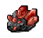

# 아이템 강화 시뮬레이터

> 바이브 코딩으로 구현된 간단한 아이템 강화 & 잠재력 시뮬레이션 웹페이지입니다.  
> 마우스 클릭 및 키보드 단축키(Q, W, R)로 아이템 강화를 시도해볼 수 있습니다.

# v1.0.0 UI
<p align="center">
  
</p>

---

## 🔍 주요 기능

1. **강화 시뮬레이터**  
   - 카드3(🌑 강화석 이미지) 클릭 혹은 `W` 키 입력 시 현재 강화 단계에 따른 성공/실패 확률로 강화 시도
   - 성공 시 단계 상승, 실패 시 하락(단 로직에 따라 유지되기도 함)
   - 강화 시도 횟수(`0→1`, …, `9→10`)와 총 사용 강화석 카운트, 사용 금액 자동 집계

2. **잠재력(감정서) 시뮬레이터**  
   - 카드2(🔍 잠재력 이미지) 클릭 혹은 `Q` 키 입력 시 등급별(고급/레어/유물/전설) 확률로 등급 변경
   - 각 등급별 획득 카운트 집계 및 총 사용 감정서 카운트, 사용 금액에 반영
   - “아이템이 (등급) 등급으로 변경되었습니다...” 형태의 컬러 메시지 출력

3. **키보드 단축키 지원**  
   - `W` → 강화 시도  
   - `Q` → 잠재력 시도  
   - `R` → 모든 상태(강화 단계, 사용 횟수, 메시지 등) **리셋**

4. **실시간 금액 계산**  
   - 강화석 가격, 감정서 가격 입력값 변경 시 즉시 “사용한 금액(₩)” 반영

5. **모바일 대응 ×**, **데스크톱 우선**  
   - 반응형 레이아웃이지만 주로 데스크톱 브라우저에 최적화

---

## 🗂️ 파일 구조
```
/ ← 프로젝트 루트
├─ index.html ← 메인 시뮬레이터 HTML + JS inline
├─ README.md ← (지금 보고 계신) 기술 문서
├─ asset/
│ ├─ enhanceStone.png ← 강화석 아이콘
│ ├─ potential.png ← 잠재력(감정서) 아이콘
│ ├─ vip.png ← 카드1 대표 이미지
│ ├─ itemEnhanceUI.png ← UI 배경 이미지
│ ├─ sussecc.mp3 ← 강화 성공 효과음
│ └─ fail.mp3 ← 강화 실패 효과음
└─ (추가 에셋들…)
```
## yaml

---

## ⚙️ 설치 & 실행

1. **레포지토리 클론**  
```bash
git clone https://github.com/your-username/stoneage_simulator.git
cd stoneage_simulator
```   
2. **정적 서버로 열기**

VSCode Live Server, Python http.server, 혹은 serve 패키지 등 아무 정적 서버면 OK
```
# Python 3.x
python -m http.server 8000
# → http://localhost:8000/index.html
```
3. **바로 브라우저에서 열기**

파일을 더블클릭해도 되지만, 로컬 파일 경로라면 효과음(mp3) 재생이 제한될 수 있습니다. 가능하면 로컬 서버 사용을 권장합니다.

---
🔧 주요 코드 구조
HTML
카드 컴포넌트: Bootstrap .card

이미지 클릭 요소
```
<div style="position:relative; display:inline-block;">
  
  <span id="enhanceKey" class="key-label">(W)</span>
</div>
```

---
🔧 주요 코드 구조
## HTML
- Bootstrap .card 컴포넌트
- 이미지 클릭 요소 예시
```
<div style="position:relative; display:inline-block;">  <span class="key-label">(W)</span> </div>
```
## CSS
```
.card-img-custom: 고정 크기, cursor: pointer

.key-label: 이미지 내 절대 위치, 클릭 가능
```

메시지·상태 텍스트: position: absolute

## JavaScript
상태 변수
```
let currentLevel = 0, usedStones = 0, usedPotentials = 0;
const attemptCounts = {'0-1':0…'9-10':0};
const potCounts = {'고급':0,'레어':0,'유물':0,'전설':0};
```

## 확률 테이블
```
const levels = {0:{success:0.25,failure:'maintain'},…};
const potentialLevels = [
{name:'고급',prob:0.6,stats:{…},color:'green'},…
];
```

## 핵심 함수

- doEnhance() → 강화 로직

- doPotential() → 잠재력 로직

- updateUI() → 모든 텍스트·카운트 업데이트

- 이벤트 바인딩
```
enhanceImg.addEventListener('click', doEnhance);
potentialImg.addEventListener('click', doPotential);
document.addEventListener('keydown', e => {
if (e.key==='q') doPotential();
if (e.key==='w') doEnhance();
if (e.key==='r') reset();
});
```
- License: MIT
- Author: 한승준
- Date: 2025-05-18 (Asia/Seoul)
- Play : https://hanseungjun.github.io/stoneAgeSimulationWeb/

