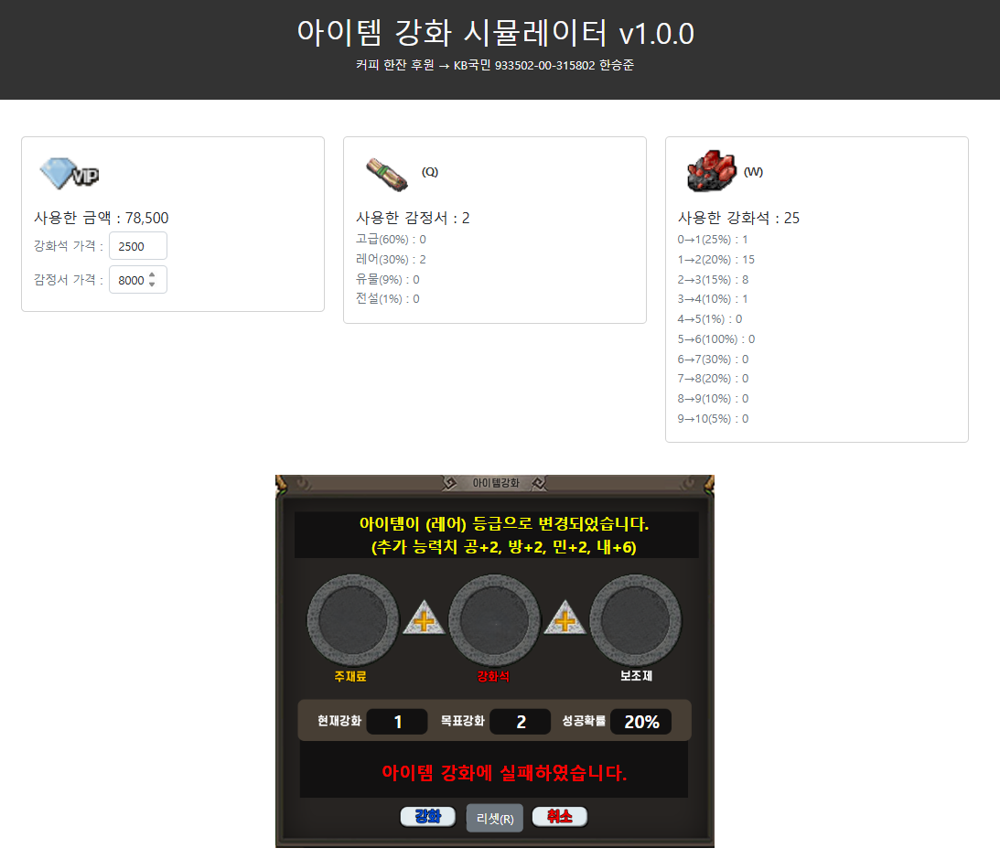

# 아이템 강화 시뮬레이터

브라우저에서 돌아가는 아이템 강화 · 잠재력 확률 시뮬레이터. 단계별 성공/실패 확률과 등급별 잠재력 확률을 테이블로 정의해 두고, **실제로 굴렸을 때 나온 값이 표기 확률과 얼마나 맞는지**를 나란히 보여준다.

**▶ [브라우저에서 바로 실행](https://hanseungjun.github.io/stoneAgeSimulationWeb/)** — 설치 없이 동작한다.



---

## 기능

### 강화

강화석을 클릭하거나 `W`를 누르면 현재 단계의 확률로 강화를 시도한다.

| 단계 | 성공 확률 | 실패 시 |
|:---:|:---:|:---:|
| 0 → 1 | 25% | 유지 |
| 1 → 2 | 20% | 유지 |
| 2 → 3 | 15% | 하락 |
| 3 → 4 | 10% | 하락 |
| 4 → 5 | 1% | 유지 |
| 5 → 6 | 100% | 보장 |
| 6 → 7 | 30% | 유지 |
| 7 → 8 | 20% | 하락 |
| 8 → 9 | 10% | 하락 |
| 9 → 10 | 5% | 하락 |

### 잠재력

감정서를 클릭하거나 `Q`를 누르면 등급을 다시 굴린다.

| 등급 | 확률 | 공 | 방 | 민 | 내 |
|:---:|:---:|:---:|:---:|:---:|:---:|
| 고급 | 60% | +1 | +1 | +1 | +3 |
| 레어 | 30% | +2 | +2 | +2 | +6 |
| 유물 | 9% | +3 | +3 | +3 | +9 |
| 전설 | 1% | +6 | +6 | +6 | +18 |

### 집계

- **구간별 실측 성공률** — `0→1` … `9→10` 각 구간의 시도 횟수와 `성공 / (성공 + 실패)`를 함께 표시한다. 표에 적힌 확률과 실제로 나온 값의 차이를 그대로 볼 수 있다
- 등급별 획득 횟수와 비율
- 강화석·감정서 **단가를 입력하면** 누적 소모 금액을 실시간으로 계산
- 시도 결과를 색으로 구분해 쌓는 로그 창

### 조작

| 키 | 동작 |
|:---:|---|
| `W` | 강화 시도 |
| `Q` | 잠재력 시도 |
| `R` | 전체 리셋 |

마우스 클릭으로도 전부 동작한다.

---

## 구현 노트

**난수는 `Math.random()`이 아니라 `crypto.getRandomValues()`를 쓴다.** 확률 시뮬레이터에서 난수의 품질은 결과의 신뢰도와 직결되므로, 균등 분포가 보장되는 쪽으로 `0 ≤ r < 1`을 만든다.

```js
function getRandom() {
  const arr = new Uint32Array(1);
  window.crypto.getRandomValues(arr);
  return arr[0] / (0xFFFFFFFF + 1);
}
```

**잠재력 등급 선택은 확률 누적 구간 방식이다.** 등급 목록을 순회하며 확률을 더해 나가다 난수가 걸리는 구간을 고르므로, 등급을 추가하거나 확률을 바꿔도 분기문을 손댈 필요가 없다.

**성공/실패 카운트를 분리해 저장한다** (v1.1.0). 시도 횟수만 세면 "몇 번 시도했나"밖에 모르지만, 성공과 실패를 따로 세면 구간별 실측 확률이 나온다 — 이 시뮬레이터의 목적 자체가 그 비교다.

---

## 실행

정적 파일뿐이라 별도 빌드가 없다.

```bash
git clone https://github.com/HanSeungJun/stoneAgeSimulationWeb.git
cd stoneAgeSimulationWeb
python -m http.server 8000
# http://localhost:8000
```

---

## 파일 구조

```
index.html            시뮬레이터 본체 (HTML + 인라인 JS)
asset/
  enhanceStone.png    강화석 아이콘
  potential.png       감정서 아이콘
  vip.png             카드 대표 이미지
  itemEnhanceUI.png   UI 참고 이미지
v1.1.0.mp4            v1.1.0 시연 영상
```

---

## 라이선스

MIT
